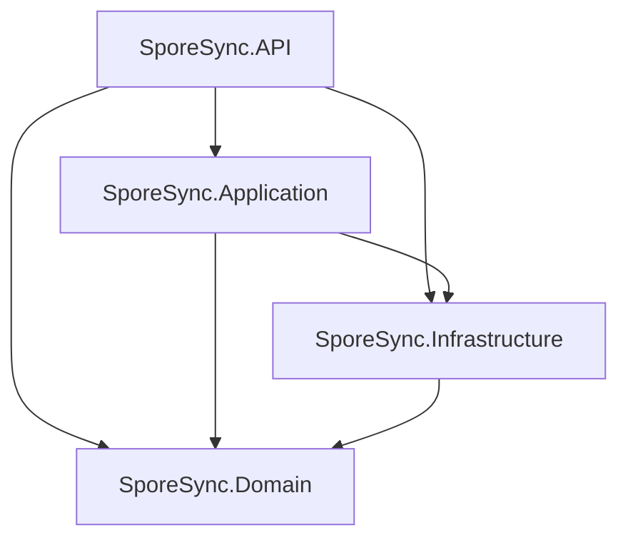

# SporeSync Service Architecture Documentation

## Overview
SporeSync follows a **Clean Architecture** pattern with clear separation of concerns across multiple layers. This document outlines the service architecture, responsibilities, and recommendations for maintaining a scalable and maintainable codebase.

## Project Structure

```
SporeSync/
├── SporeSync.Domain/          # Core business models and interfaces
├── SporeSync.Application/     # Use cases and application services  
├── SporeSync.API/            # Web API controllers and configuration
├── SporeSync.Infrastructure/ # External dependencies (future)
└── SporeSync.sln             # Solution file
```

## Layer Dependencies



**Dependency Rules:**
- ✅ **API** can reference **Application** and **Domain**
- ✅ **Application** can reference **Domain** only
- ✅ **Infrastructure** can reference **Domain** only
- ❌ **Domain** should NOT reference any other layers
- ❌ Lower layers should NOT reference higher layers

## Layer Responsibilities

### 1. SporeSync.Domain 🎯
**Purpose:** Core business logic and domain models

**Contains:**
- ✅ **Models** (`FileInfo`, `Directory`, `SshConfiguration`)
- ✅ **Enums** (`FileStatus`, `AuthenticationType`)
- ✅ **Interfaces** (`ISshService`, `IFileTrackingService`)
- ✅ **Domain Services** (pure business logic)
- ✅ **Value Objects** (future: `FilePath`, `FileHash`)

**Rules:**
- No external dependencies (except system libraries)
- No knowledge of databases, file systems, or web frameworks
- Pure business logic only
- All other layers depend on this one

**Example Services:**
```csharp
// Domain service example
public class FileHashValidator
{
    public bool IsValidHash(string hash) => hash.Length == 64;
}
```

### 2. SporeSync.Application 🚀
**Purpose:** Application use cases and orchestration

**Contains:**
- ✅ **Use Cases** (`SyncDirectoryUseCase`, `TrackFilesUseCase`)
- ✅ **Application Services** (`FileSyncService`, `DirectoryManagementService`)
- ✅ **DTOs** (Data Transfer Objects for API)
- ✅ **Command/Query Handlers** (future CQRS pattern)
- ✅ **Validation Logic** (business rule validation)

**Rules:**
- Can reference Domain layer only
- Contains application-specific business logic
- Orchestrates domain services
- No knowledge of external concerns (databases, web, SSH implementation)

**Example Services:**
```csharp
public class FileSyncService
{
    private readonly ISshService _sshService;
    private readonly IFileTrackingService _fileTrackingService;
    
    public async Task<SyncResult> SyncDirectoryAsync(int directoryId)
    {
        // Orchestrate domain services
        var changes = await _fileTrackingService.GetChangedFilesAsync(directoryId);
        // ... business logic
    }
}
```

### 3. SporeSync.API 🌐
**Purpose:** HTTP API and user interface

**Contains:**
- ✅ **Controllers** (`FileController`, `DirectoryController`)
- ✅ **API Models** (Request/Response DTOs)
- ✅ **Middleware** (authentication, error handling)
- ✅ **Configuration** (`Program.cs`, `appsettings.json`)
- ✅ **Dependency Injection** setup

**Rules:**
- Can reference Application and Domain layers
- Handles HTTP concerns only
- Maps between API models and application DTOs
- Configures dependency injection container

**Example Controller:**
```csharp
[ApiController]
[Route("api/[controller]")]
public class FilesController : ControllerBase
{
    private readonly FileSyncService _fileSyncService;
    
    [HttpPost("sync/{directoryId}")]
    public async Task<IActionResult> SyncDirectory(int directoryId)
    {
        var result = await _fileSyncService.SyncDirectoryAsync(directoryId);
        return Ok(result);
    }
}
```

### 4. SporeSync.Infrastructure 🔧 (Future)
**Purpose:** External dependencies and infrastructure concerns

**Will Contain:**
- ✅ **SSH.NET Implementation** (`SshService` implementing `ISshService`)
- ✅ **Database Access** (Entity Framework, repositories)
- ✅ **File System Services** (local file operations)
- ✅ **External APIs** (cloud storage, notification services)
- ✅ **Configuration Providers** (environment variables, key vault)

**Rules:**
- Can reference Domain layer only
- Implements interfaces defined in Domain
- Contains all external dependencies
- No business logic

**Example Implementation:**
```csharp
public class SshService : ISshService
{
    public async Task<bool> TestConnectionAsync(SshConfiguration config)
    {
        using var client = new SshClient(config.Host, config.Port, config.Username, config.Password);
        // SSH.NET implementation
    }
}
```

## Service Type Guidelines

### Domain Services
**When to use:** Pure business logic that doesn't depend on external systems
- File validation rules
- Business calculations
- Domain rule enforcement

### Application Services  
**When to use:** Orchestrating multiple domain services or external operations
- Use case implementations
- Workflow coordination
- Cross-cutting concerns (logging, validation)

### Infrastructure Services
**When to use:** Interacting with external systems
- Database operations
- File system access
- Network communications
- Third-party API calls

## Current Implementation Status

### ✅ Completed
- [x] Domain models (`FileInfo`, `Directory`, `SshConfiguration`)
- [x] Domain interfaces (`ISshService`, `IFileTrackingService`) 
- [x] Project structure with proper references
- [x] Solution file configuration

### 🚧 In Progress
- [ ] Application services implementation
- [ ] API controllers
- [ ] Dependency injection configuration

### 📋 Recommended Next Steps
1. **Create Application Services** in `SporeSync.Application`
2. **Implement Controllers** in `SporeSync.API`
3. **Configure DI Container** in `Program.cs`
4. **Create Infrastructure Project** when external dependencies are needed
5. **Add Unit Tests** for each layer

## Best Practices

### ✅ Do
- Keep Domain layer pure (no external dependencies)
- Use interfaces for all external dependencies
- Implement business logic in Application services
- Keep Controllers thin (delegation only)
- Use dependency injection for loose coupling

### ❌ Don't
- Put business logic in Controllers
- Reference higher layers from lower layers
- Mix infrastructure concerns with business logic
- Create circular dependencies between projects
- Bypass the Application layer from API controllers

## Testing Strategy
- **Domain:** Unit tests for business logic
- **Application:** Integration tests with mocked dependencies  
- **API:** Integration tests with test server
- **Infrastructure:** Integration tests with real external systems

## Migration Path
If you need to refactor existing services:
1. Start with Application services
2. Move infrastructure concerns to Infrastructure project later
3. Keep Domain pure throughout the process
4. Use interfaces to maintain loose coupling during transitions
